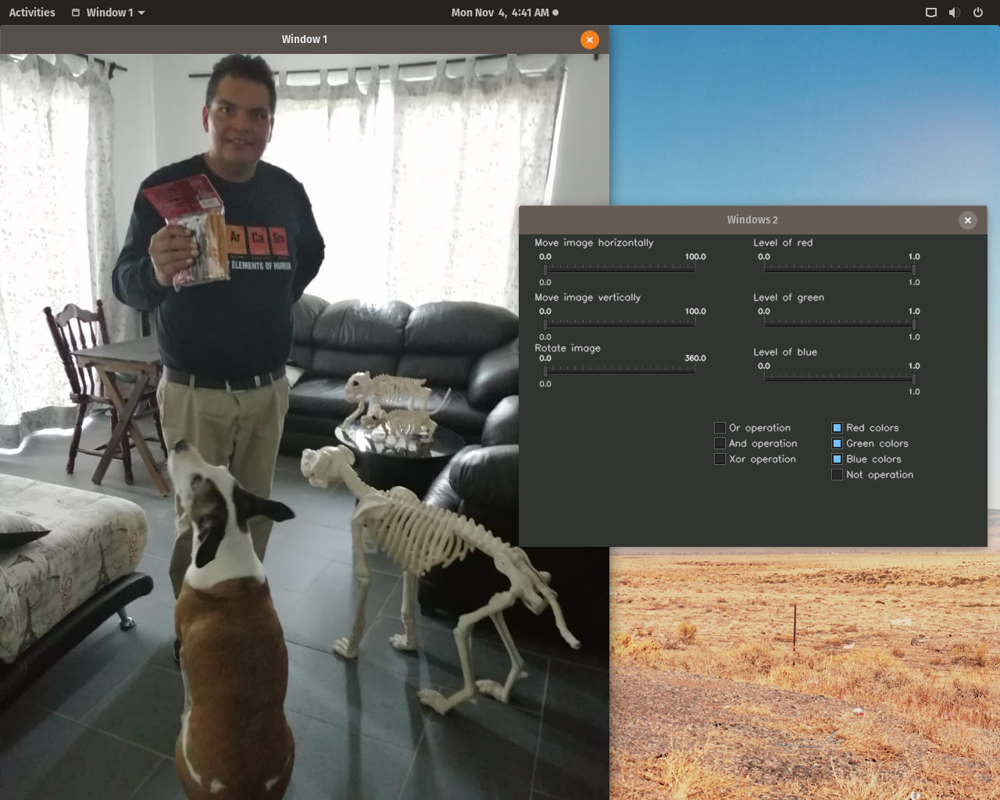

# Opencv-visualizer-c-

This project consist of a image visualizer using Opencv c++ and aplying the primitive algorithm to modify the images. Build the project using the cvui instead of Qt, because of the simplicity of the library and also because it wasn't necesary too many components to build the aplication.

## Requirements to build the project
* Opencv c++

##Instructions to to build and run
1. You have to give execution permisions to the openexecute file (with superuser chmod +x openexecute)
1. Than you have to give them 3 extra parameters
    * The first one must be a 0 or 1 one. If it is zero the images would be loaded with grayscale otherwise with color.
    * The other two parameters must be two images to make possible the binary operations

## Features

* And operation
* Or operation
* No operation
* Sum operation
* Sub operation
* Vertical border detection
* Horizontal border detection
* RGB Color regulators
* Traslation  ~ broke :( 
* Rotation  ~ broke :( 

